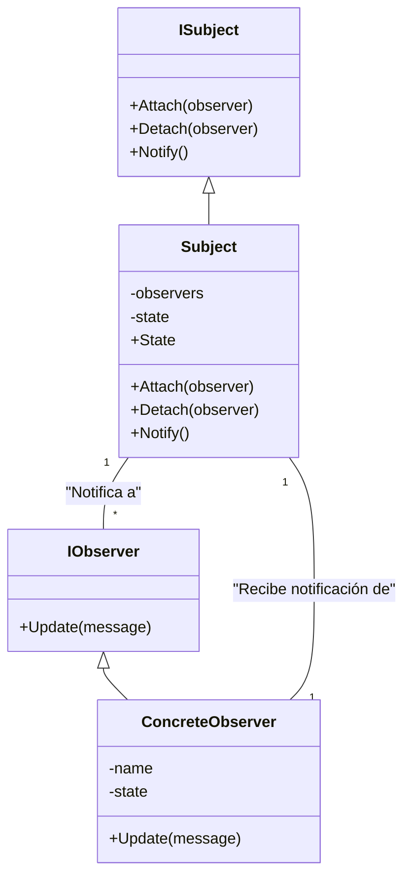

```mermaid
classDiagram
    ISubject : +Attach(observer)
    ISubject : +Detach(observer)
    ISubject : +Notify()
    
    IObserver : +Update(message)
    
    Subject : -observers
    Subject : -state
    Subject : +Attach(observer)
    Subject : +Detach(observer)
    Subject : +Notify()
    Subject : +State

    ConcreteObserver : -name
    ConcreteObserver : -state
    ConcreteObserver : +Update(message)

    ISubject <|-- Subject
    IObserver <|-- ConcreteObserver
    Subject "1" -- "*" IObserver : "Notifica a"
    ConcreteObserver "1" -- "1" Subject : "Recibe notificación de"

```