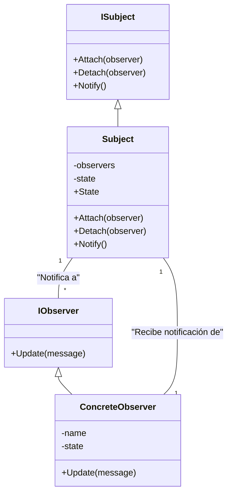

## Patrón de Diseño: **Observer**

### Descripción
El patrón **Observer** es un patrón de diseño de comportamiento que permite que un objeto (el **subject**) notifique a otros objetos (los **observers**) cuando su estado cambia. Este patrón es útil cuando necesitas mantener la coherencia entre un conjunto de objetos sin acoplarlos de manera estricta.

En este proyecto, implementamos el patrón **Observer** utilizando las siguientes clases:

- **ISubject**: Define las operaciones que un **subject** debe implementar para poder ser observado.
- **IObserver**: Define las operaciones que un **observer** debe implementar para recibir notificaciones del **subject**.
- **Subject**: Implementa la lógica para mantener una lista de observadores y notificarles cuando su estado cambia.
- **ConcreteObserver**: Implementa la lógica para recibir las actualizaciones del **subject** y almacenar el estado actualizado.

### Crear la solución y los proyectos
Primero, crea una nueva solución llamada `Comportamiento` con el siguiente comando:

```bash
dotnet new sln -o Comportamiento
cd Comportamiento
dotnet new classlib -o Comportamiento.Domain
dotnet sln add ./Comportamiento.Domain/Comportamiento.Domain.csproj
dotnet new nunit -o Comportamiento.Domain.Tests
dotnet sln add ./Comportamiento.Domain.Tests/Comportamiento.Domain.Tests.csproj
dotnet add ./Comportamiento.Domain.Tests/Comportamiento.Domain.Tests.csproj reference ./Comportamiento.Domain/Comportamiento.Domain.csproj
code .
```

### Implementación del Patrón Observer

1. **Definir la interfaz `IObserver`**

   Se definió la interfaz `IObserver` que los observadores deben implementar para poder recibir actualizaciones del **subject**. Esta interfaz contiene el método `Update`:

   ```csharp
   public interface IObserver
   {
       void Update(string message);
   }

2. **Definir la interfaz `ISubject`**

    La interfaz ISubject define los métodos que un objeto debe implementar para poder gestionar sus observadores y notificarles cambios:

    ```csharp
    public interface ISubject
    {
        void Attach(IObserver observer);
        void Detach(IObserver observer);
        void Notify();
    }

3. **Definir la interfaz `Subject`**

    La clase Subject implementa la interfaz ISubject y mantiene una lista de observadores. Cuando su estado cambia, notifica a todos los observadores registrados:

    ```csharp
    public class Subject : ISubject
    {
        private List<IObserver> _observers = new List<IObserver>();
        private string _state = "";

        public string State
        {
            get { return _state; }
            set
            {
                _state = value;
                Notify();
            }
        }

        public void Attach(IObserver observer)
        {
            _observers.Add(observer);
        }

        public void Detach(IObserver observer)
        {
            _observers.Remove(observer);
        }

        public void Notify()
        {
            foreach (var observer in _observers)
            {
                observer.Update(_state);
            }
        }
    }

4. **Definir la interfaz `ConcreteObserver`**

    La clase ConcreteObserver implementa la interfaz IObserver y define cómo se maneja la actualización cuando el estado del subject cambia. También incluye una propiedad State que permite acceder al valor del estado actualizado:

    ```csharp
    public class ConcreteObserver : IObserver
    {
        private string _name;
        private string _state;

        public string State => _state;

        public ConcreteObserver(string name)
        {
            _name = name;
        }

        public void Update(string message)
        {
            _state = message;
            Console.WriteLine($"{_name} received update: {_state}");
        }
    }

### Pruebas Unitarias
    
Se crearon pruebas unitarias para verificar que el patrón Observer funciona correctamente. Las pruebas aseguran que los observadores reciben la actualización cuando el subject cambia su estado.
Se crea el archivo ObserverTests.cs en Comportamiento.Domain.Tests

    ```csharp
    using NUnit.Framework;
    using Comportamiento.Domain;

    namespace Comportamiento.Domain.Tests
    {
        public class ObserverTests
        {
            [Test]
            public void TestObserverPattern()
            {
                // Crear un Subject
                var subject = new Subject();

                // Crear dos Observers
                var observer1 = new ConcreteObserver("Observer 1");
                var observer2 = new ConcreteObserver("Observer 2");

                // Attach los Observers al Subject
                subject.Attach(observer1);
                subject.Attach(observer2);

                // Cambiar el estado del Subject
                subject.State = "State 1";

                // Verificar que los Observers recibieron el mensaje
                Assert.AreEqual("State 1", observer1.State);
                Assert.AreEqual("State 1", observer2.State);
            }
        }
    }
    ```

### Diagrama del del proyecto Observer
